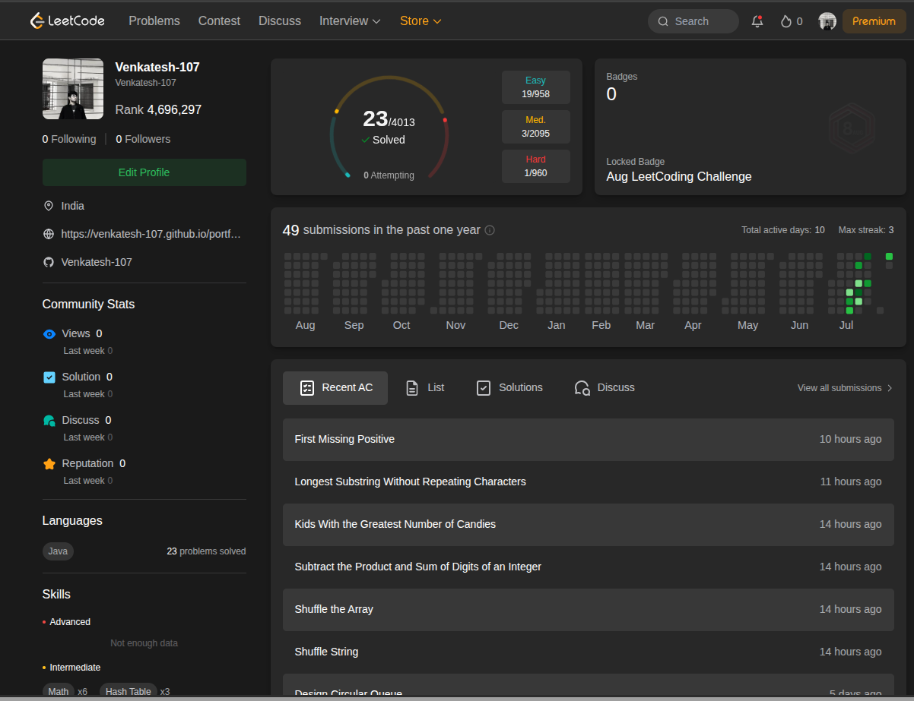

# ☕ Java LeetCode Practice



A polished Java project showcasing LeetCode problem solutions and algorithm skills. Ideal for LinkedIn sharing, this repo highlights 25+ Java solutions, clean folder organization, and practical coding examples for interview preparation.

Repository: https://github.com/Venkatesh-107/Java-LeetCode-practice

---

## Repository Overview

- **Language:** Java 17+
- **Focus:** LeetCode problem-solving, algorithm practice, and data structures
- **Structure:** Each problem is stored in its own folder with solution code and a README

## How to Use

1. Open a problem folder.
2. Review the solution code in the Java file.
3. Compile and run the Java file from the command line or your IDE.

Example:
```bash
javac 1205-defanging-an-ip-address/defanging-an-ip-address.java
java -cp 1205-defanging-an-ip-address DefangingIPAddress
```

> Note: Some files may use a custom class name. Adjust the command to match the class name in the source file.

## Metrics

| Metric | Details |
| :--- | :--- |
| **Profile** | [@Venkatesh-107](https://leetcode.com/u/Venkatesh-107/) |
| **Language** | Java 17+ |
| **Automation** | Folders auto-sorted by difficulty on push |

## Notes

- The repository contains both LeetCode problem folders and additional Java practice tasks.
- Each folder may include a `README.md` describing the problem and solution approach.

